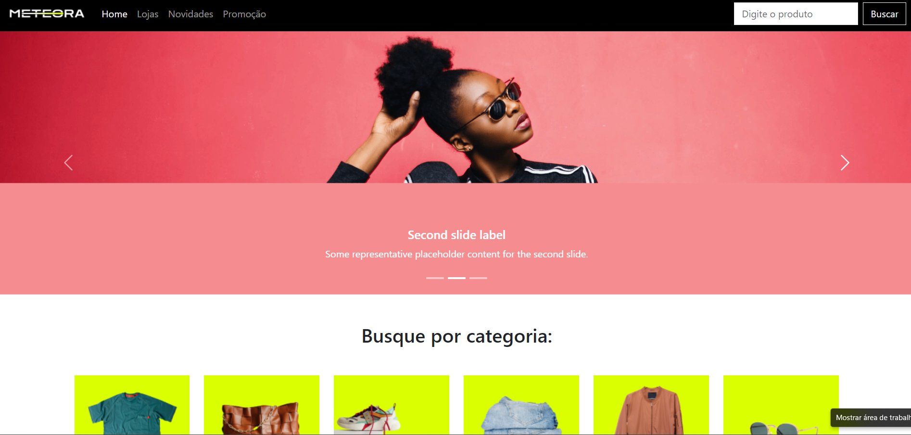

## Projeto simulando um e-commerce 
Projeto desenvolvido para esimular uma loja virtual com Bootstrap e JavaScriot.

### Clone o Repositório
git clone https://github.com/AndressaTurchetto/ecommerce-with-bootstrap.git

